# Pump Monitor: Predictive Maintenance System (Warman Slurry Pump)


## Overview

A **predictive maintenance (PdM)** system for industrial centrifugal pumps, aligned with **ISO 10816-3** vibration zones and tailored for **Warman-type slurry pumps**. Consumes telemetry over MQTT, applies DSP and ML, and raises rule-based and model-based alerts. Supports automatic shutdown scenarios (vibration interlock, debris impact, choked discharge, cavitation, overtemperature) and optional Telegram notifications.

### Example industrial use case

Typical deployment scenario:

- Asset: Warman-type slurry pump on a grinding or flotation circuit.
- Telemetry source: vibration sensor on bearing housing + process signals
  (current, pressure, temperature, cavitation proxy) from PLC/DCS.
- Edge node: small industrial PC in the MCC or control room, running this PdM
  engine in Docker.
- Integration:
  - PdM engine subscribes to MQTT telemetry topic;
  - sends status and alarm messages to a separate MQTT alerts topic;
  - optionally sends CRITICAL/WARNING alerts with human-readable reason to a
    Telegram chat for the maintenance team.
- Operator workflow:
  - in Zone C (WARNING) the system suggests planned inspection and maintenance;
  - in Zone D (CRITICAL) or when rules detect cavitation / choked discharge /
    debris impact / overtemperature, the system raises a clear alert with
    cause code and message;
  - the digital twin (`simulate_failure.py`) can be used offline to tune
    thresholds and train personnel on typical scenarios before enabling
    automatic actions on the real plant.

### Features

- **ISO 10816-3 (Group 1, rigid):** Zone C (WARNING) at 4.5 ≤ V < 7.1 mm/s, Zone D (CRITICAL) at V ≥ 7.1 mm/s; hysteresis for exit from WARNING/CRITICAL.
- **Rule-based diagnostics:** Debris impact (stone hit), cavitation, choked discharge, degradation (impeller wear), temperature/overload/pressure, air ingestion; each with a dedicated alert message.
- **ML inference:** Random Forest classifier (8 features: vib_rms, vib_crest, vib_kurtosis, current, pressure, cavitation_index, temp, temp_delta); rolling smoothing and asymmetric risk smoothing.
- **Signal processing:** Butterworth filter (configurable); overall RMS over feature window; optional band alignment for strict ISO (see docs).
- **Shutdown scenarios (simulation/digital twin):** Vibration interlock (V ≥ 9.0 mm/s), Debris impact, Choked discharge, Cavitation (sustained 10 s), Overtemperature (T ≥ 75°C sustained); each logs a row and triggers “RESTART” in the digital twin.
- **Startup handling:** First 3 inference runs use higher CRITICAL threshold (0.90) to reduce false alerts.
- **Security:** TLS v1.2 for MQTT; secrets via environment variables only.
- **Telegram:** Optional alerts for CRITICAL/WARNING with reason text.

---

## Project Structure

```
├── app/                      # Application core
│   ├── main_app.py           # MQTT client and analysis pipeline
│   ├── data_processor.py     # DSP, batching, feature preparation
│   ├── feature_extractor.py  # Vibration metrics, process, cavitation index, temp_delta
│   ├── predictor.py          # ML inference, rules (ISO, choked, cavitation, etc.), smoothing
│   ├── rules.py              # Rule classes (Mechanical, Cavitation, Choked, Degradation, …)
│   ├── telemetry_validator.py # Min/max validation before DSP/ML
│   ├── csv_logger.py         # CSV write queue (telemetry_history, alerts_history)
│   ├── notifier.py           # Telegram alerts
│   ├── logger.py             # Structured logging and rotation
│   └── healthcheck.py        # Config/artifact validation; Docker health check
├── config/
│   ├── config.py             # Centralized configuration (ISO thresholds, messages, etc.)
│   ├── validation.py         # Config validation at startup
│   └── utils.py              # config_float and helpers
├── docs/
│   ├── en/                 # English: ARCHITECTURE, system_trigger_scenarios, RULE_PRIORITY_AND_HYSTERESIS, ML_REPORT
│   ├── ru/                 # Русский: те же документы
│   └── he/                 # עברית: אותן מסמכים
├── screenshots/             # CLI and plot screenshots (simulate_cli_*.png, Figure_*.png)
├── models/                   # ML artifacts (pump_rf_*.joblib, scaler_*.joblib)
├── certs/                    # TLS certificates (ca.crt, client.crt, client.key)
├── logs/                     # telemetry_history.csv, alerts_history.csv, app_status.log
├── tests/
│   ├── test_smoke.py        # System readiness checks
│   ├── test_dsp.py          # DSP (Butterworth, Crest Factor, ISO band RMS)
│   ├── test_units.py        # Unit tests (features, predictor, rules, notifier)
│   ├── test_engine.py       # Engine MQTT/pipeline with mocked client
│   ├── test_integration.py  # Validation, rules, pipeline, e2e predictor
│   └── test_csv_healthcheck.py # CSV logger and healthcheck exit codes
├── train_and_save.py        # Train and persist model + scaler (synthetic zones)
├── simulate_failure.py      # Digital twin: gradual wear, stone hit, choked, cavitation, etc. (3 s interval)
├── emulator.py              # MQTT telemetry generator (sandbox)
├── publish_mqtt_telemetry.py # CLI tool to publish sample telemetry
├── plot_monitoring.py       # Plot telemetry_history.csv (vibration zones, risk)
├── requirements.txt
├── Dockerfile
├── docker-compose.yml
├── deploy.sh                # Standalone Docker deploy script
└── Makefile                 # Common commands
```

---

## Architecture

```
[ Sensor Data ] → [ MQTT Broker (Mosquitto) ] → [ Python Engine (Docker) ]
                                                         │
                                             +-----------+-----------+
                                             │           │           │
                                       [ ML + Rules ] [ DSP ] [ CSV Logs ]
                                             │
                                       [ Telegram Alert ]
```

- **Feature window:** 30 samples per batch for stable vibration metrics (RMS, Crest Factor, Kurtosis).
- **Inference trigger:** Every 5 new MQTT messages (`MQTT_BATCH_SIZE=5`).
- **Rolling smoothing:** Last 3 feature vectors averaged before prediction (`SMOOTHING_WINDOW_SIZE=3`); risk history size 3; asymmetric alpha for rise/fall.
- **Startup:** First 3 runs use CRITICAL threshold 0.90 to avoid false positives.
- **Rules (priority order):** Mechanical/debris → Cavitation → Choked → Degradation → Temperature → Overload → Pressure → Air ingestion → Vibration Zone C/D → Vibration interlock (V ≥ 9.0 mm/s by default, above Zone D).

---

## Telemetry JSON Schema (MQTT)

The engine expects each MQTT telemetry message on `TOPIC_TELEMETRY` to be a JSON object
with the following fields (all numeric):

```json
{
  "vib_rms": 2.5,
  "vib_crest": 3.1,
  "vib_kurtosis": 3.2,
  "current": 45.0,
  "pressure": 6.0,
  "temp": 38.0,
  "cavitation_index": 0.05
}
```

- `vib_rms`: vibration velocity RMS (mm/s) over the feature window.
- `vib_crest`: crest factor proxy (peak / RMS or similar).
- `vib_kurtosis`: vibration kurtosis proxy.
- `current`: motor current (A).
- `pressure`: process pressure (bar).
- `temp`: temperature (°C).
- `cavitation_index`: scalar index of cavitation severity.

Both `emulator.py` and `publish_mqtt_telemetry.py` publish payloads in this format so
that `DataProcessor.prepare_batch()` and `FeatureExtractor` can operate without any
special cases.

---

## Vibration Zones (ISO 10816-3)

Vibration velocity (`vib_rms`) is assumed to be measured at **bearing housing or equivalent** (non-rotating part), per ISO 10816-3. For strict band alignment, set `USE_ISO_BAND_FOR_ZONES = True` in config to use RMS in the 10–1000 Hz band for zone and shutdown decisions.

| Zone   | Range (mm/s RMS) | Status   | Config / behaviour |
|--------|-------------------|----------|----------------------|
| B      | V < 4.5           | Acceptable | Exit WARNING when V < 4.5 |
| C      | 4.5 ≤ V < 7.1     | WARNING  | Operational entry at 5.5 + risk ≥ 15% to reduce flicker |
| D      | V ≥ 7.1           | CRITICAL | Unacceptable; message: reduce load or stop for inspection |
| Interlock | V ≥ 9.0 (default) | Shutdown | Vibration interlock; stop and inspect (config: VIBRATION_INTERLOCK_MMPS) |

Boundary 7.1 belongs to Zone D only. See `config/config.py` and [docs/en/ARCHITECTURE.md](docs/en/ARCHITECTURE.md).

---

## Shutdown Scenarios (Digital Twin / simulate_failure.py)

| Scenario             | Condition                         | Log status                    |
|----------------------|-----------------------------------|-------------------------------|
| Vibration interlock | vib_display ≥ 9.0 mm/s (default; above Zone D) | VIBRATION_INTERLOCK           |
| Debris impact       | CRITICAL + debris/mechanical      | DEBRIS_IMPACT_SHUTDOWN        |
| Choked discharge    | CRITICAL + choked message        | CHOKED_DISCHARGE_SHUTDOWN     |
| Cavitation          | CRITICAL + cavitation ≥ 10 s      | CAVITATION_SHUTDOWN           |
| Overtemperature     | CRITICAL + T ≥ 75°C sustained 10 s| OVERTEMPERATURE_SHUTDOWN     |

Each writes a row to `telemetry_history.csv` and resets the twin (health=0, RESTART). See [docs/en/system_trigger_scenarios.md](docs/en/system_trigger_scenarios.md) (or [docs/ru/](docs/ru/) / [docs/he/](docs/he/) for other languages).

---

## Pipeline Tuning (config/config.py)

Key parameters (see `config/config.py` for full list):

| Parameter                         | Description                                      | Default |
|-----------------------------------|--------------------------------------------------|---------|
| FEATURE_WINDOW_SIZE               | Telemetry records per batch                      | 30      |
| MQTT_BATCH_SIZE                   | Run pipeline every N new MQTT messages           | 5       |
| SMOOTHING_WINDOW_SIZE             | Last N feature vectors averaged before inference| 3       |
| RISK_HISTORY_SIZE                 | Last N risk values for display probability      | 3       |
| STARTUP_ITERATIONS                | Runs with relaxed CRITICAL threshold             | 3       |
| PROB_CRITICAL                    | Anomaly probability for CRITICAL                 | 0.85    |
| PROB_WARNING                     | Anomaly probability for WARNING                  | 0.60    |
| PROB_CRITICAL_STARTUP             | CRITICAL threshold during startup               | 0.90    |
| VIBRATION_CRITICAL_MMPS          | Zone D start (ISO 10816-3)                       | 7.1     |
| VIBRATION_WARNING_MMPS            | Zone C start; exit WARNING when V < this        | 4.5     |
| VIBRATION_INTERLOCK_MMPS         | Vibration interlock limit (above Zone D)         | 9.0     |

After changing `FEATURE_NAMES` or zone logic, retrain with `make train`.

---

## ML Stack

- **Random Forest** for interpretability, small data, and edge-friendly inference.
- **8 features:** vib_rms, vib_crest, vib_kurtosis, current, pressure, cavitation_index, temp, temp_delta.
- **Three-class:** Healthy (0), Warning (1), Critical (2); risk = P(Warning) + P(Critical).
- Training uses synthetic data aligned with `HEALTHY_MEANS`, `WARNING_MEANS`, `CRITICAL_MEANS` in config. Run `make train` to produce model, scaler, and `models/ml_report.txt` (validation metrics, feature importance). See [docs/en/ML_REPORT.md](docs/en/ML_REPORT.md).

---

## Screenshots

Example output of the **digital twin** (`make simulate`) and **monitoring plots** (`plot_monitoring.py`). All images are in the [`screenshots/`](screenshots/) folder.

| Description | Screenshot |
|-------------|------------|
| CLI start / healthy run | 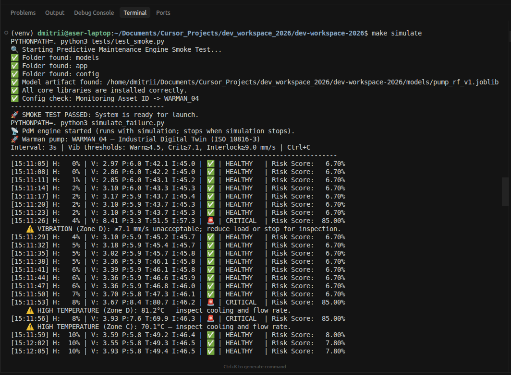 |
| Buffer / batch | 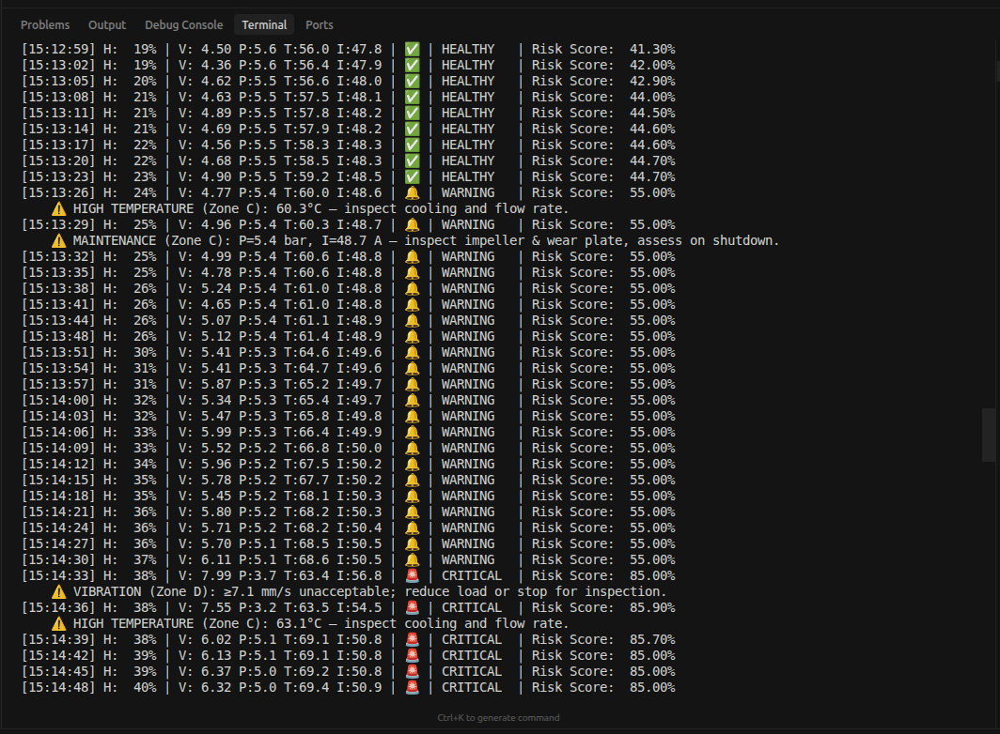 |
| WARNING zone | 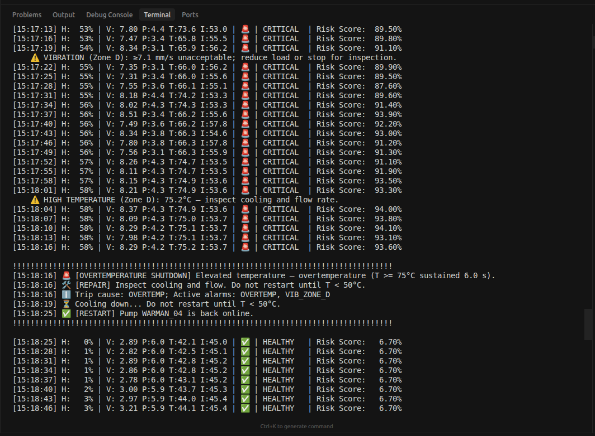 |
| CRITICAL / cavitation | 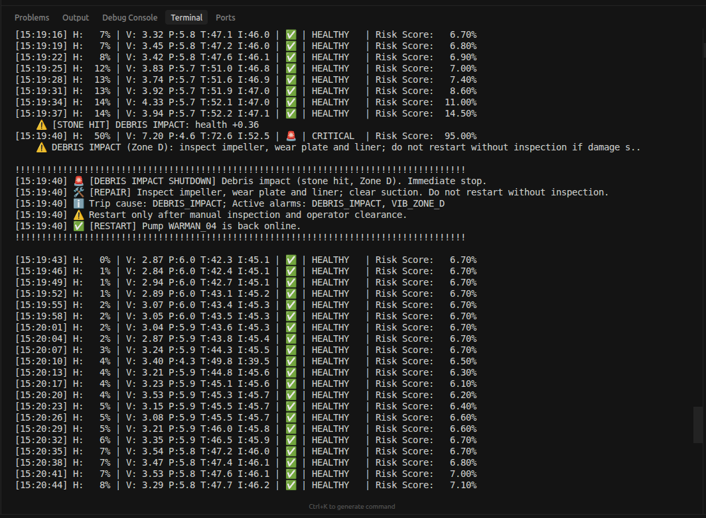 |
| Shutdown message | 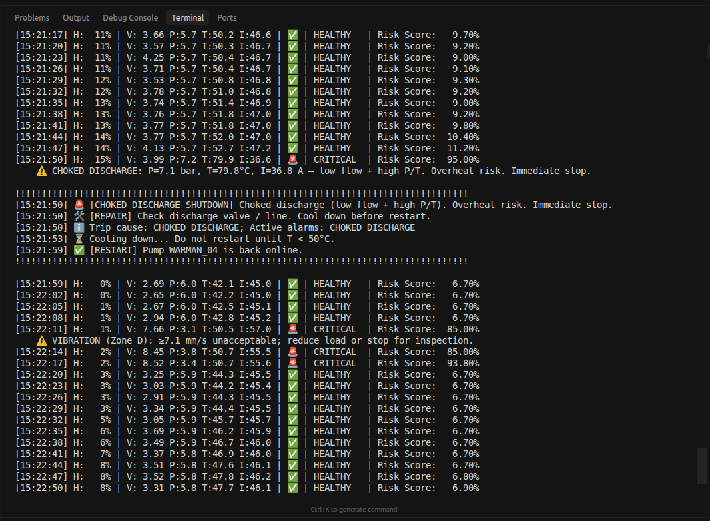 |
| RESTART after shutdown | 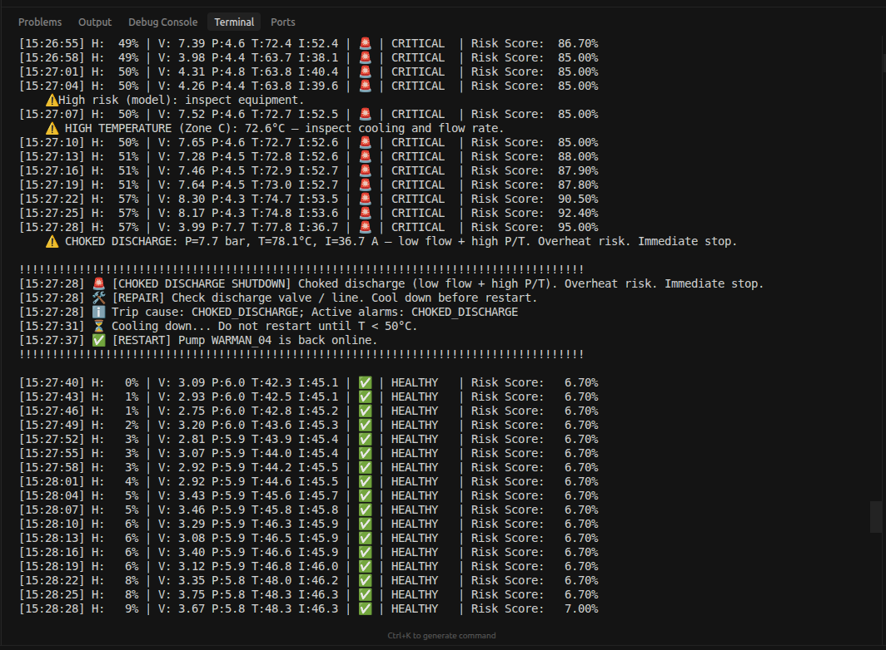 |
| Degradation / maintenance | 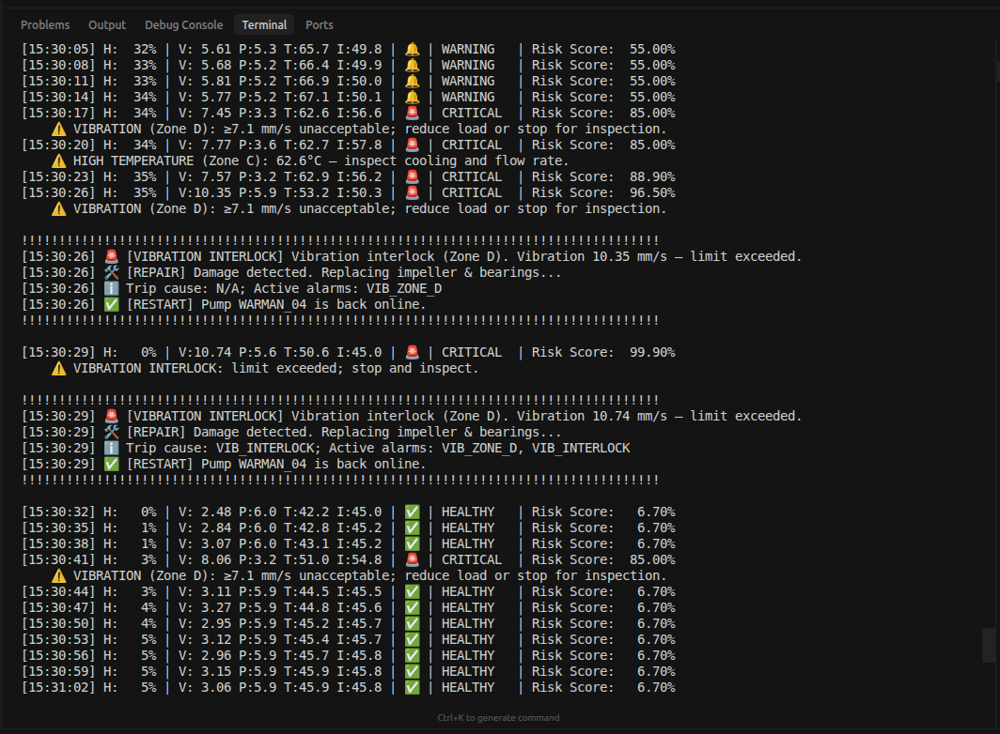 |
| Choked / overtemp | 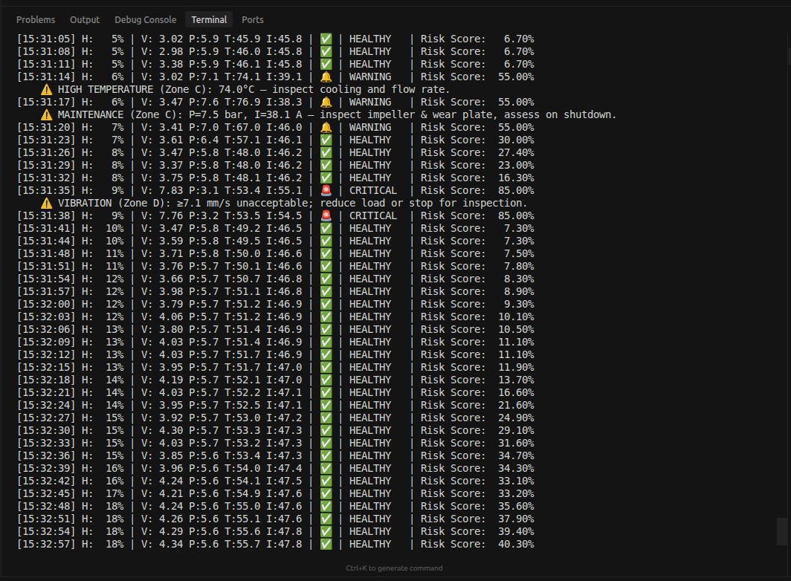 |
| Summary / exit | 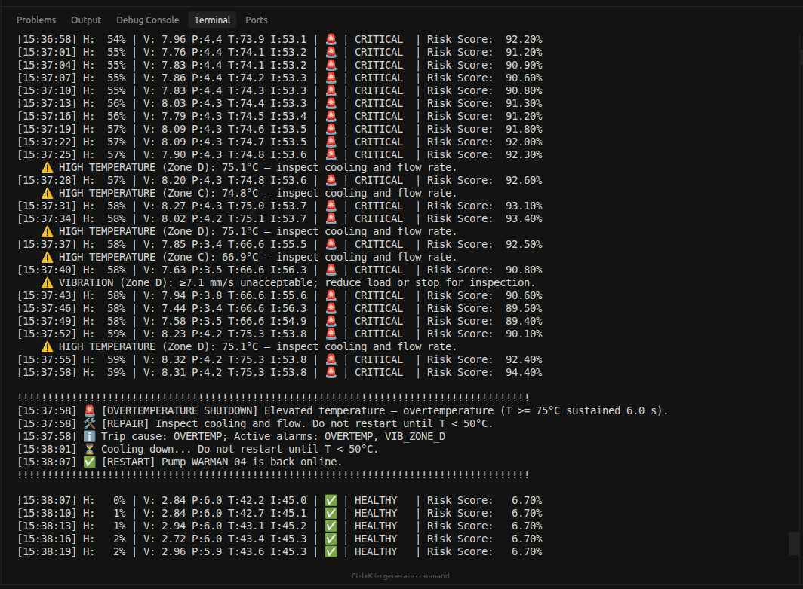 |
| Plot: vibration zones and risk | 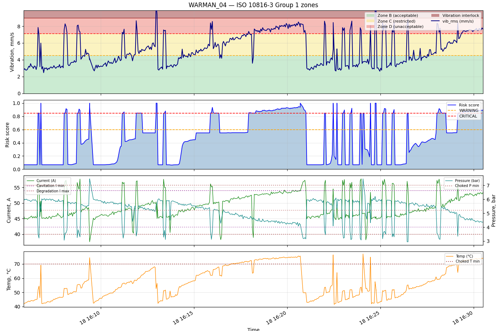 |
| Plot: risk over time | 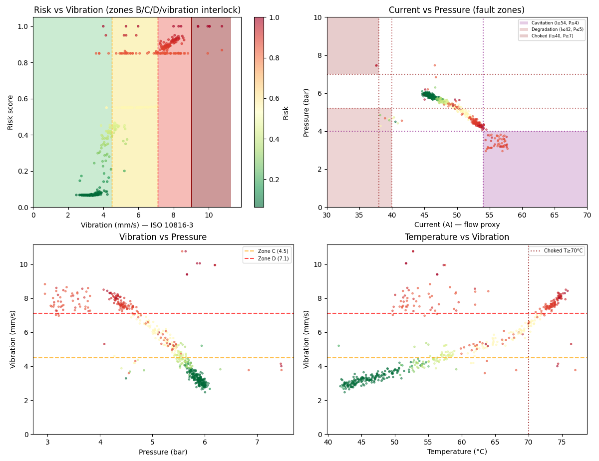 |

---

## Quick Start

### 1. Install dependencies

```bash
python -m venv venv
source venv/bin/activate   # Linux/macOS
pip install -r requirements.txt
```

### 2. Configure

```bash
cp .env.example .env
# Edit .env: MQTT_BROKER, MQTT_PORT, TG_TOKEN, TG_CHAT_ID, CERT_DIR, LOG_DIR, etc.
```

### 3. Train the model

Model artifacts (`pump_rf_*.joblib`, `scaler_*.joblib`) are not in the repo; generate them before first run:

```bash
make train
# or: PYTHONPATH=. python3 train_and_save.py
```

### 4. Verify

```bash
make test                  # All tests
PYTHONPATH=. python3 tests/test_smoke.py   # Smoke only
make simulate              # Smoke + digital twin (3 s steps; Ctrl+C to stop)
```

### 5. Run the application

**With TLS** (certificates in `certs/`):

```bash
PYTHONPATH=. python3 app/main_app.py
```

**Without TLS** (local dev):

```bash
MQTT_USE_TLS=false MQTT_PORT=1883 PYTHONPATH=. python3 app/main_app.py
```

---

## Simulation (Digital Twin)

`simulate_failure.py` runs a Warman-style digital twin: gradual wear, rare stone hit, degradation/choked/air ingestion episodes, and shutdown scenarios. Interval 3 s; vibration and risk follow ISO 10816-3 and config thresholds. The PdM engine can run as a subprocess (started by the script) or separately; with Docker, run `make docker-down` first if you want only the simulation to write logs.

```bash
make simulate
# Interval: 3s | Warning ≥4.5, Critical ≥7.1 mm/s (ISO 10816-3) | Ctrl+C to stop
```

---

## Environment Variables

| Variable          | Description                                      | Default          |
|-------------------|--------------------------------------------------|------------------|
| MQTT_BROKER       | MQTT broker host                                 | 10.20.30.45      |
| MQTT_PORT         | Port (8883 TLS, 1883 plain)                      | 8883             |
| MQTT_USE_TLS      | Use TLS for MQTT                                 | true             |
| MQTT_TLS_INSECURE | Disable TLS hostname verification (dev only)     | false            |
| PUMP_ID           | Pump/asset identifier                             | PUMP_01          |
| SECTION_ID        | Plant section identifier                          | PLANT_SECTION_01 |
| MODEL_VERSION     | Model artifact version (e.g. v1)                 | v1               |
| TG_TOKEN          | Telegram bot token                               | —                |
| TG_CHAT_ID        | Telegram chat ID for alerts                      | —                |
| CERT_DIR          | Path to TLS certificates                          | certs/           |
| LOG_DIR           | Directory for logs and CSV                        | logs/            |
| STRICT_ARTIFACT_CHECK | If `true`, fail startup when model/scaler missing (default: false) | false   |

---

## Docker

```bash
make docker-up    # Build and start stack
make docker-down  # Stop services
make status       # Container status
make logs        # Tail pump_monitor logs
```

Standalone script: `./deploy.sh`. Certificates mounted at `CERT_DIR`; healthcheck runs `app/healthcheck.py`.

---

## Security

- MQTT over TLS v1.2 (port 8883).
- Secrets only via environment variables.
- Place `ca.crt`, `client.crt`, and `client.key` in `certs/`.

---

## Documentation

- **docs/en/** (English) — [ARCHITECTURE](docs/en/ARCHITECTURE.md), [system_trigger_scenarios](docs/en/system_trigger_scenarios.md), [RULE_PRIORITY_AND_HYSTERESIS](docs/en/RULE_PRIORITY_AND_HYSTERESIS.md), [ML_REPORT](docs/en/ML_REPORT.md); simulation screenshots linked from ARCHITECTURE.
- **docs/ru/** (русский) — те же документы на русском: архитектура, сценарии срабатывания, приоритет правил и гистерезис, ML-отчёт.
- **docs/he/** (עברית) — אותן מסמכים בעברית: ארכיטקטורה, תרחישי טריגר, עדיפות כללים והיסטרזיס, דוח ML.

---

## Makefile Commands

| Command              | Description                                      |
|----------------------|--------------------------------------------------|
| make install         | Install dependencies and pre-commit hooks       |
| make train           | Train and save model and scaler                  |
| make test            | Run all tests (pytest)                           |
| make simulate        | Smoke test + failure simulation (digital twin)  |
| make simulate-standalone | Stop Docker monitor, then run simulation     |
| make docker-up       | Start stack with Docker Compose                  |
| make docker-down     | Stop Compose services                            |
| make clean           | Remove cache and trained models                  |
| make rebuild         | Clean, rebuild, and start Docker                 |
| make status          | Container status                                 |
| make logs            | Tail monitor service logs                        |
| make help            | List commands                                    |

---

## Visualization

Plot telemetry and risk from CSV:

```bash
PYTHONPATH=. python3 plot_monitoring.py
```

Uses `logs/telemetry_history.csv` (or `LOG_DIR`); shows vibration zones (B/C/D/vibration interlock) and risk.

---

## Author

Dmitrii German

<!-- PdM repo -->
