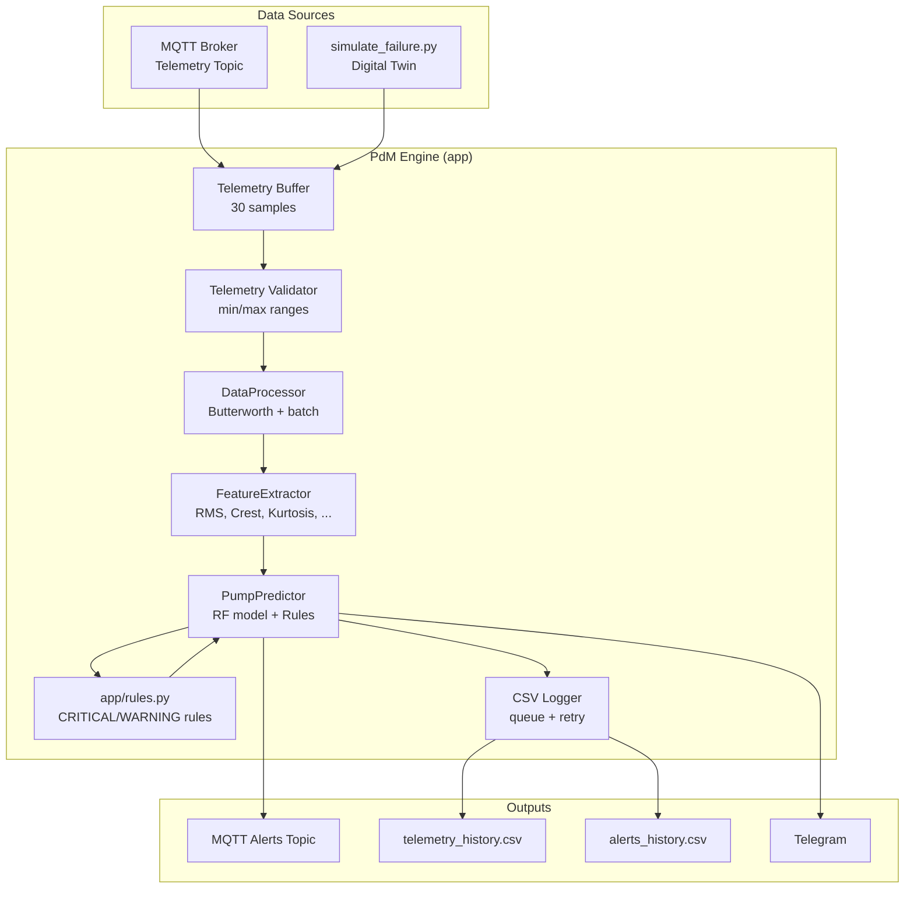
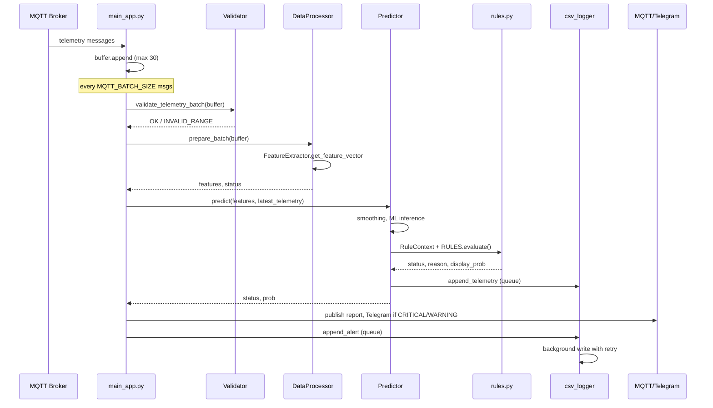
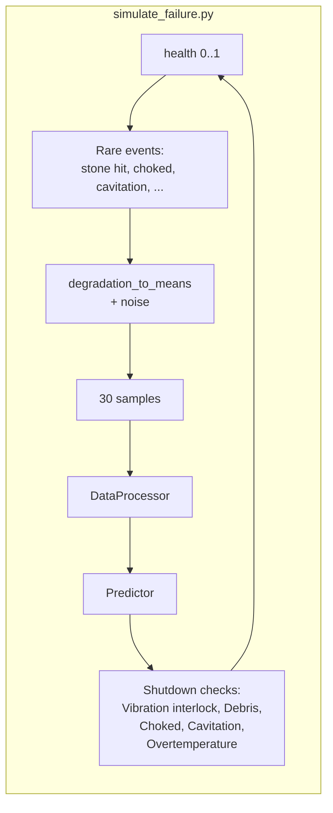

# PdM System Architecture (Predictive Maintenance)

Brief description of components and data flows. Diagrams use Mermaid.

---

## 1. High-Level Overview



---

## 2. Data Flow (Live Engine)



---

## 3. Telemetry Message Format (MQTT)

Each message on the telemetry topic (`Config.TOPIC_TELEMETRY`) is a single JSON object
with the following numeric fields:

```json
{
  "vib_rms": 2.5,
  "vib_crest": 3.1,
  "vib_kurtosis": 3.2,
  "current": 45.0,
  "pressure": 6.0,
  "temp": 38.0,
  "cavitation_index": 0.05
}
```

This schema is used consistently by:

- `app/main_app.py` → buffers raw telemetry and passes it to `DataProcessor.prepare_batch()`.
- `app/data_processor.py` → validates telemetry via `validate_telemetry_batch()` and calls `FeatureExtractor`.
- `emulator.py` and `publish_mqtt_telemetry.py` → local/sandbox publishers that emit
  the same field set so that the engine behaves identically with real or simulated data.

---

## 4. Simulation (Digital Twin)



See [Simulation screenshots](#5-simulation-screenshots) for example CLI output.

---

## 5. Simulation screenshots

Example output of the digital twin (`make simulate`). Screenshots are in the repository under `screenshots/`.

| Step / moment | Screenshot |
|---------------|------------|
| CLI start / healthy run |  |
| Buffer / batch |  |
| WARNING zone |  |
| CRITICAL / cavitation |  |
| Shutdown message |  |
| RESTART after shutdown |  |
| Degradation / maintenance |  |
| Choked / overtemp |  |
| Summary / exit |  |

Optional plots from `plot_monitoring.py` (vibration zones and risk over time):

| Plot | Screenshot |
|------|------------|
| Figure 1 |  |
| Figure 2 |  |

---

## 6. Modules and Responsibilities

| Module | Purpose |
|--------|---------|
| **app/main_app.py** | MQTT client, buffer, pipeline invocation, reconnect with backoff, alert on prolonged message absence |
| **app/telemetry_validator.py** | Min/max validation of telemetry before DSP/ML |
| **app/data_processor.py** | Butterworth filter, batch preparation, FeatureExtractor invocation |
| **app/feature_extractor.py** | Feature computation (vib_rms, vib_crest, vib_kurtosis, current, pressure, cavitation_index, temp, temp_delta) |
| **app/predictor.py** | Model/scaler loading, risk smoothing, rule orchestration, telemetry logging to CSV (via queue) |
| **app/rules.py** | Rule classes (Mechanical, Cavitation, Choked, Degradation, Temperature, Overload, Pressure, Air, Vibration, Interlock, FinalCleanup) |
| **app/csv_logger.py** | CSV write queue with retry on error (telemetry_history, alerts_history) |
| **app/notifier.py** | Telegram alert delivery |
| **app/healthcheck.py** | Config and artifact validation; exit 0/1 for Docker/CI health checks |
| **config/config.py** | Thresholds, topics, paths, TLS flags |
| **config/validation.py** | Config validation at startup (fail-fast); used by healthcheck |

---

## 7. Related Documents

- [system_trigger_scenarios.md](system_trigger_scenarios.md) — all trigger scenarios and thresholds
- [RULE_PRIORITY_AND_HYSTERESIS.md](RULE_PRIORITY_AND_HYSTERESIS.md) — rule priority and hysteresis
- [ML_REPORT.md](ML_REPORT.md) — ML model, validation metrics, feature importance
