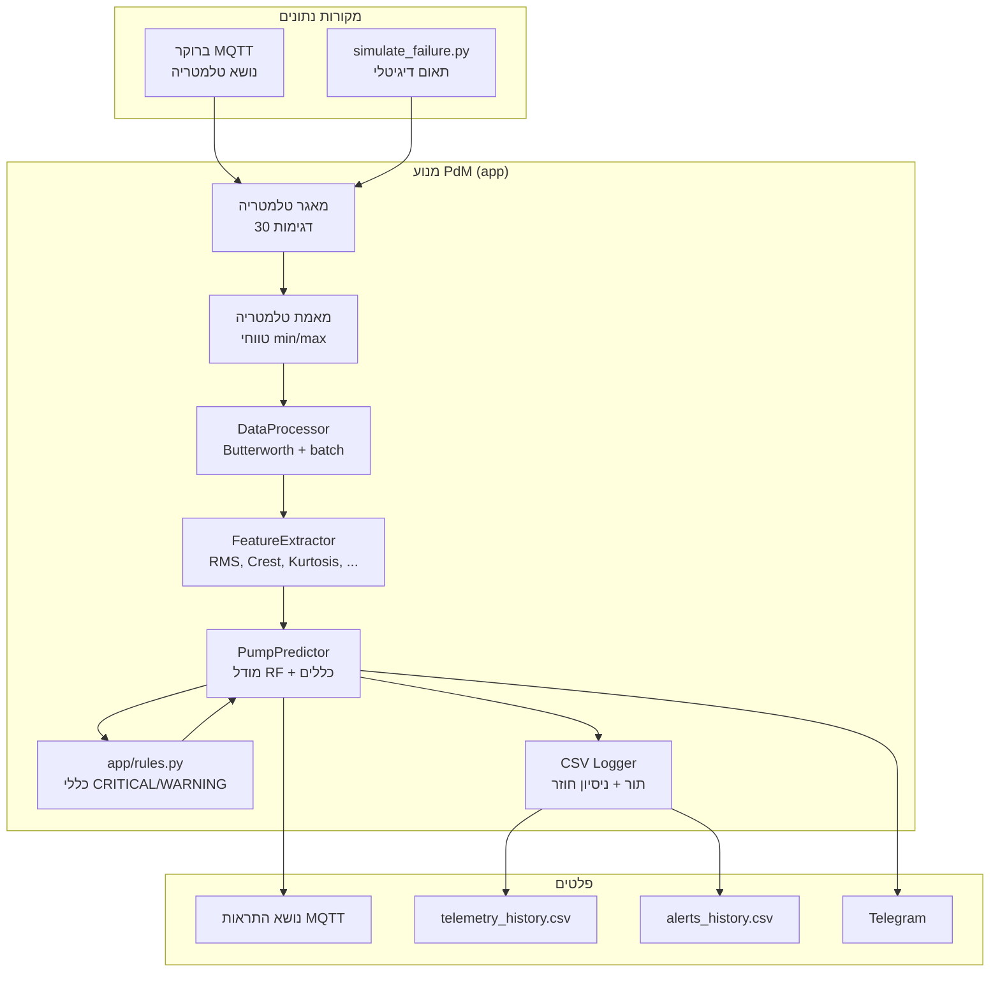
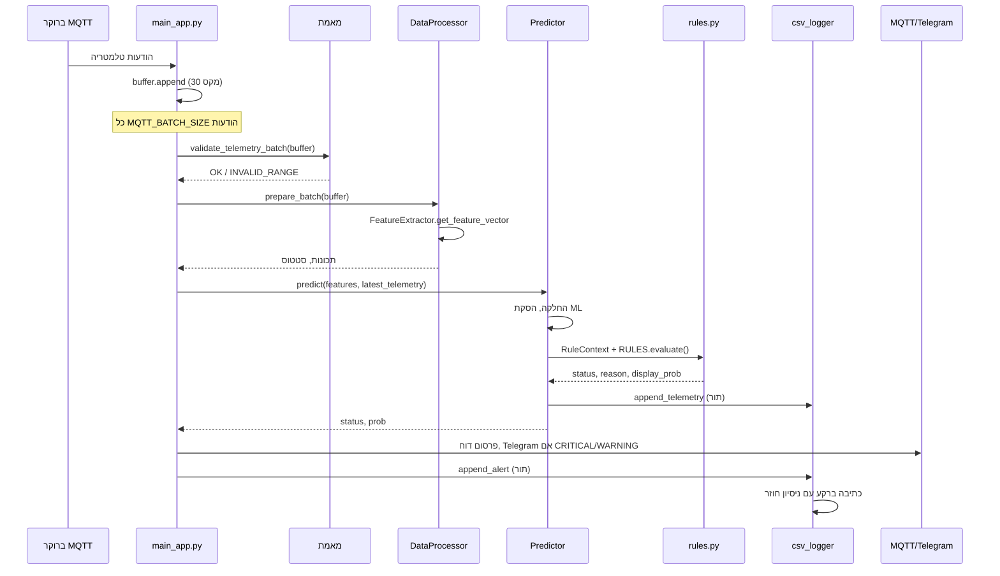
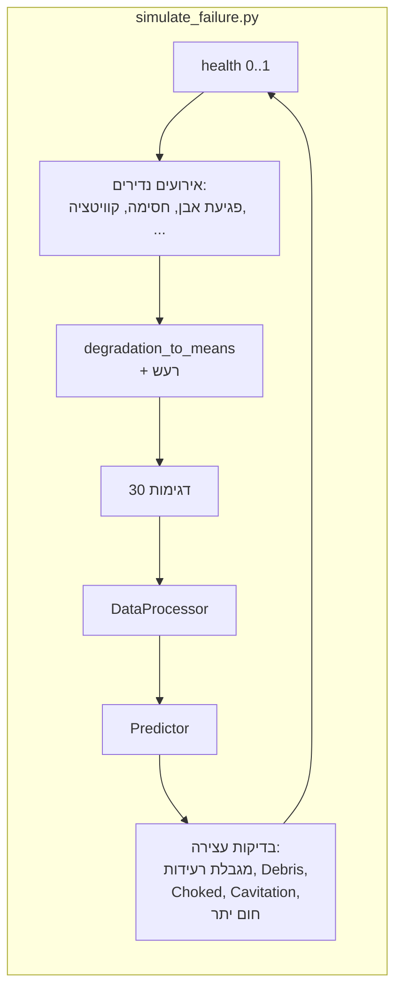

# ארכיטקטורת מערכת PdM (תחזוקה חיזויית)

תיאור קצר של רכיבים וזרימות נתונים. דיאגרמות ב-Mermaid.

---

## 1. סקירה ברמה גבוהה



---

## 2. זרימת נתונים (מנוע חי)



---

## 3. פורמט הודעת טלמטריה (MQTT)

כל הודעה בנושא הטלמטריה (`Config.TOPIC_TELEMETRY`) היא אובייקט JSON בודד עם השדות המספריים הבאים:

```json
{
  "vib_rms": 2.5,
  "vib_crest": 3.1,
  "vib_kurtosis": 3.2,
  "current": 45.0,
  "pressure": 6.0,
  "temp": 38.0,
  "cavitation_index": 0.05
}
```

הסכמה הזו בשימוש עקבי על ידי:

- `app/main_app.py` — מאגר טלמטריה גולמית והעברה ל-`DataProcessor.prepare_batch()`.
- `app/data_processor.py` — אימות טלמטריה דרך `validate_telemetry_batch()` וקריאה ל-`FeatureExtractor`.
- `emulator.py` ו-`publish_mqtt_telemetry.py` — מפרסמים באותו סט שדות.

---

## 4. סימולציה (תאום דיגיטלי)



ראה [צילומי מסך של הסימולציה](#5-צילומי-מסך-של-הסימולציה).

---

## 5. צילומי מסך של הסימולציה

דוגמת פלט של התאום הדיגיטלי (`make simulate`). צילומי המסך במאגר בתיקייה `screenshots/`.

| שלב / רגע | צילום מסך |
|-----------|------------|
| התחלת CLI / ריצה תקינה |  |
| מאגר / batch |  |
| אזור WARNING |  |
| CRITICAL / קוויטציה |  |
| הודעת עצירה |  |
| RESTART אחרי עצירה |  |
| התדרדרות / תחזוקה |  |
| חסימה / חום יתר |  |
| סיכום / יציאה |  |

גרפים אופציונליים מ-`plot_monitoring.py` (אזורי רעידות וסיכון לאורך זמן):

| גרף | צילום מסך |
|-----|------------|
| Figure 1 |  |
| Figure 2 |  |

---

## 6. מודולים ואחריות

| מודול | תכלית |
|-------|--------|
| **app/main_app.py** | לקוח MQTT, מאגר, הפעלת צינור, התחברות מחדש עם backoff, התראה על היעדר הודעות ממושך |
| **app/telemetry_validator.py** | אימות min/max של טלמטריה לפני DSP/ML |
| **app/data_processor.py** | מסנן Butterworth, הכנת batch, קריאה ל-FeatureExtractor |
| **app/feature_extractor.py** | חישוב תכונות (vib_rms, vib_crest, vib_kurtosis, current, pressure, cavitation_index, temp, temp_delta) |
| **app/predictor.py** | טעינת מודל/scaler, החלקת סיכון, ארגון כללים, רישום ל-CSV (דרך תור) |
| **app/rules.py** | מחלקות כלל (Mechanical, Cavitation, Choked, Degradation, Temperature, Overload, Pressure, Air, Vibration, Interlock, FinalCleanup) |
| **app/csv_logger.py** | תור כתיבת CSV עם ניסיון חוזר בשגיאה |
| **app/notifier.py** | משלוח התראות ל-Telegram |
| **app/healthcheck.py** | אימות config וארטיפקטים; exit 0/1 לבדיקות Docker/CI |
| **config/config.py** | ספים, נושאים, נתיבים, דגלי TLS |
| **config/validation.py** | אימות config בהפעלה; בשימוש ב-healthcheck |

---

## 7. מסמכים קשורים

- [system_trigger_scenarios.md](system_trigger_scenarios.md) — כל תרחישי הטריגר והספים
- [RULE_PRIORITY_AND_HYSTERESIS.md](RULE_PRIORITY_AND_HYSTERESIS.md) — עדיפות כללים והיסטרזיס
- [ML_REPORT.md](ML_REPORT.md) — מודל ML, מדדי ולידציה, חשיבות תכונות
