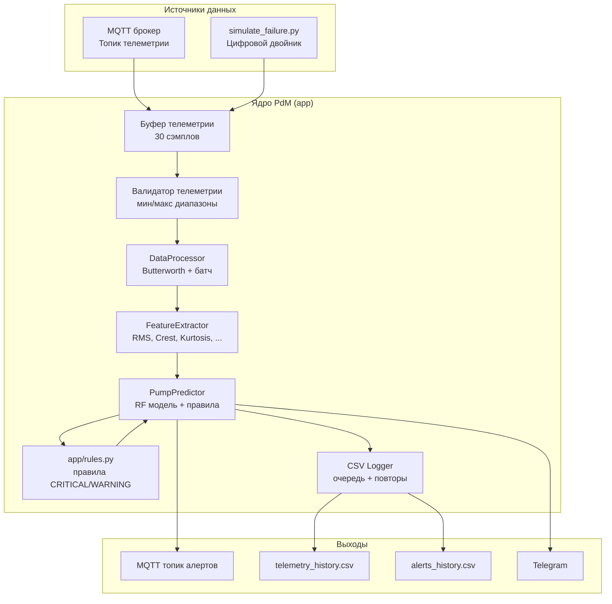
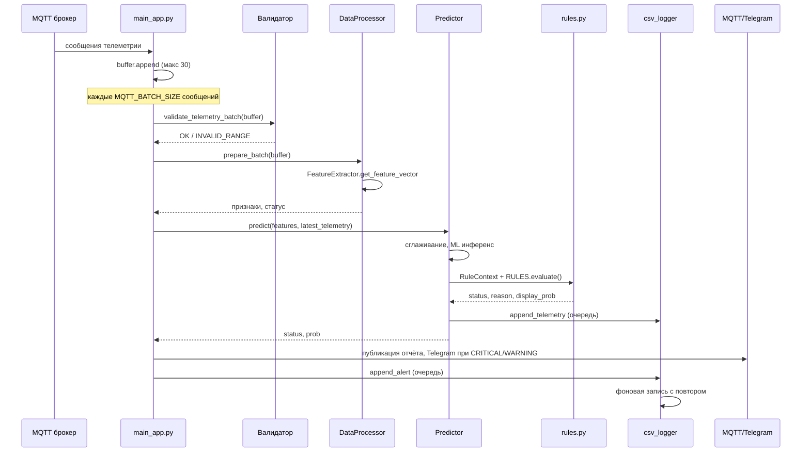
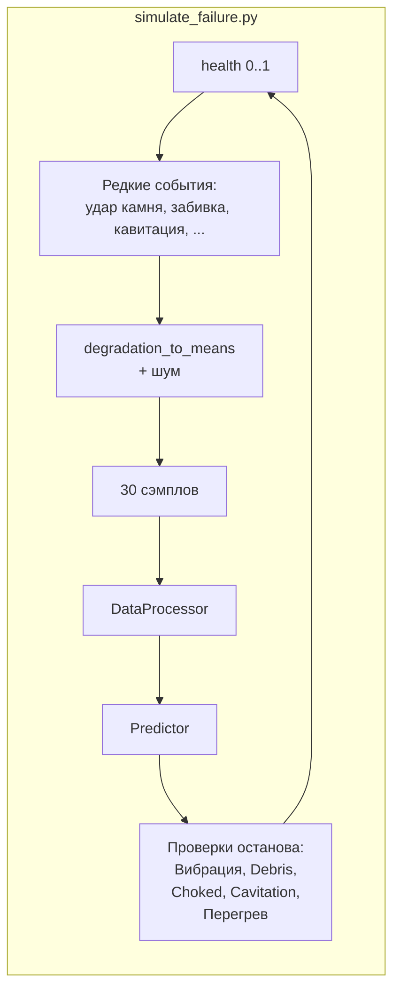

# Архитектура системы PdM (предиктивное обслуживание)

Краткое описание компонентов и потоков данных. Диаграммы в формате Mermaid.

---

## 1. Обзор высокого уровня



---

## 2. Поток данных (рабочий движок)



---

## 3. Формат сообщения телеметрии (MQTT)

Каждое сообщение в топике телеметрии (`Config.TOPIC_TELEMETRY`) — один JSON-объект с числовыми полями:

```json
{
  "vib_rms": 2.5,
  "vib_crest": 3.1,
  "vib_kurtosis": 3.2,
  "current": 45.0,
  "pressure": 6.0,
  "temp": 38.0,
  "cavitation_index": 0.05
}
```

Эту схему используют:

- `app/main_app.py` — буферизует телеметрию и передаёт в `DataProcessor.prepare_batch()`.
- `app/data_processor.py` — валидирует через `validate_telemetry_batch()` и вызывает `FeatureExtractor`.
- `emulator.py` и `publish_mqtt_telemetry.py` — издатели телеметрии в том же формате.

---

## 4. Симуляция (цифровой двойник)



См. [скриншоты симуляции](#5-скриншоты-симуляции).

---

## 5. Скриншоты симуляции

Пример вывода цифрового двойника (`make simulate`). Файлы в репозитории: `screenshots/`.

| Момент | Скриншот |
|--------|----------|
| Старт CLI / нормальный режим |  |
| Буфер / батч |  |
| Зона WARNING |  |
| CRITICAL / кавитация |  |
| Сообщение об останове |  |
| RESTART после останова |  |
| Деградация / обслуживание |  |
| Забивка / перегрев |  |
| Итог / выход |  |

Графики из `plot_monitoring.py` (зоны вибрации и риск):

| График | Скриншот |
|--------|----------|
| Figure 1 |  |
| Figure 2 |  |

---

## 6. Модули и ответственность

| Модуль | Назначение |
|--------|------------|
| **app/main_app.py** | MQTT-клиент, буфер, вызов пайплайна, реконнект с backoff, алерт при длительном отсутствии сообщений |
| **app/telemetry_validator.py** | Проверка мин/макс телеметрии перед DSP/ML |
| **app/data_processor.py** | Фильтр Butterworth, подготовка батча, вызов FeatureExtractor |
| **app/feature_extractor.py** | Расчёт признаков (vib_rms, vib_crest, vib_kurtosis, current, pressure, cavitation_index, temp, temp_delta) |
| **app/predictor.py** | Загрузка модели/скалера, сглаживание риска, оркестрация правил, запись в CSV через очередь |
| **app/rules.py** | Классы правил (Mechanical, Cavitation, Choked, Degradation, Temperature, Overload, Pressure, Air, Vibration, Interlock, FinalCleanup) |
| **app/csv_logger.py** | Очередь записи CSV с повтором при ошибке |
| **app/notifier.py** | Отправка алертов в Telegram |
| **app/healthcheck.py** | Проверка конфига и артефактов; exit 0/1 для Docker/CI |
| **config/config.py** | Пороги, топики, пути, флаги TLS |
| **config/validation.py** | Валидация конфига при старте; используется healthcheck |

---

## 7. Связанные документы

- [system_trigger_scenarios.md](system_trigger_scenarios.md) — все сценарии срабатывания и пороги
- [RULE_PRIORITY_AND_HYSTERESIS.md](RULE_PRIORITY_AND_HYSTERESIS.md) — приоритет правил и гистерезис
- [ML_REPORT.md](ML_REPORT.md) — ML-модель, метрики, важность признаков
